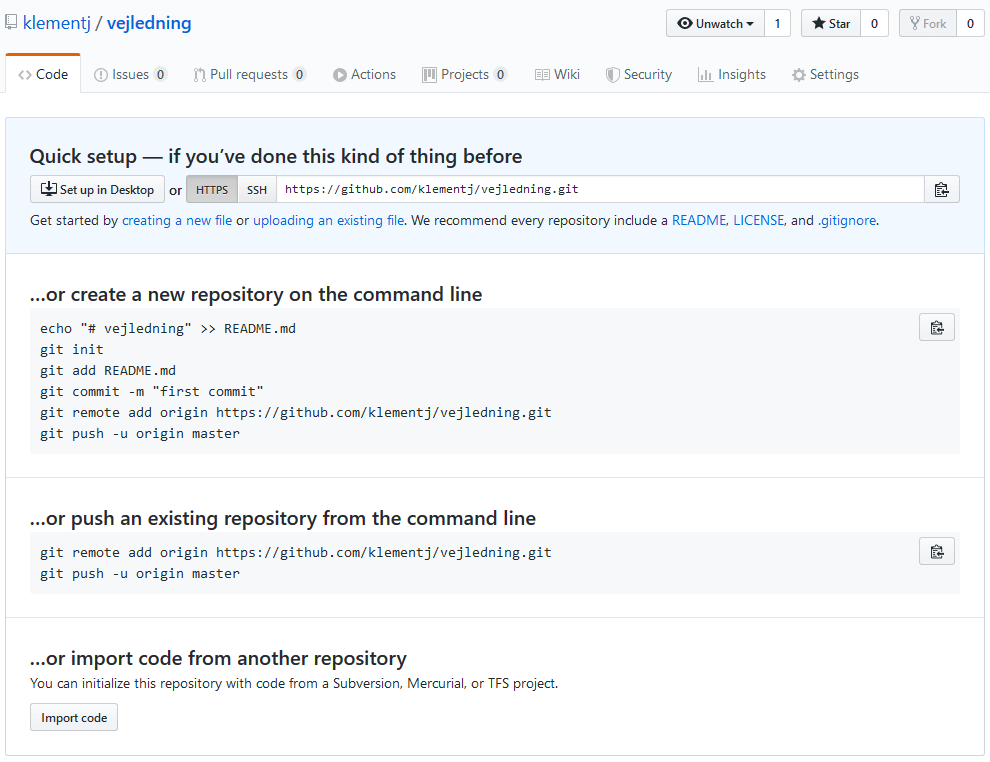

# Modul 2: Oprette remote git repository

I dette modul skal du oprette et remote git repository og forbinde dit lokale repository til det remote. Inden du starter modulet skal du have [oprettet et lokalt repository](https://github.com/AspIT-Hanne/github/tree/master/Modul1-Oprette%20lokalt%20repository).

Du vil efter modulet have kendskab til følgende git kommandoer:
* `remote add`
* `push`
* `pull`
* `status`
* `log`

## Oprette et remote git repository
Du opretter dit remote repository på github.com. Når du har oprettet dit remote repository og givet det et navn, får du i næste skærmbillede en vejledning til, hvordan du kobler dit lokale repository sammen med dit remote repository.

Da du allerede har oprettet et lokalt repository, skal du kun tilføje det remote site, som du skal tilføje til og lave dit første push.

Det betyder, at du kan bruge den vejledning, der står i afsnittet ".. or push an existing repository from the command line".

## Konfigurer placeringen for dit remote repository

Dit remote site får et alias - det almindeligt anvendte alias er origin. Du kan herefter henvise til "origin" hver gang, du skal henvise til URL'en for dit remote repository.

## Lav dit første push, så du får dine første data op i dit remote repository

`git push -u origin master` "skubber" dine lokale ændringer op til dit remote repository. Origin er alias'et for URL'en for dit remote repository. Master er den branch, du vil pushe ændringer fra. Vi kommer mere ind på branches i en senere opgave.

Argumentet `-u` fortæller `git pull` hvilket remote repository og hvilken branch den skal bruge på efterfølgende pulls. Hvis det ikke sættes nu, så skal man efterfølgende skrive `git pull origin master` hver gang, i stedet for `git pull`, når ændringer skal hentes ned fra remote. 
